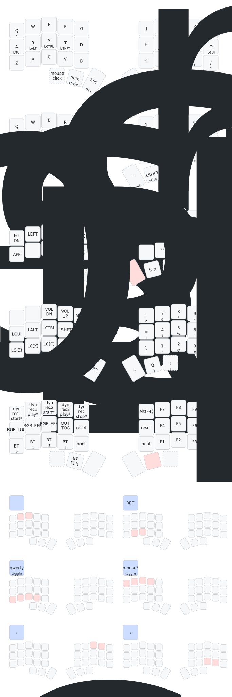

# Some ZMK config files

## Layout diagram for my Minidox keymap

*April 2025*: I moved to Qwerty (with thumb alphas) after 2.5 years of using exclusively Colemak :confused: because maintaining two keyboard layouts in muscle memory is just too annoying.

- Originally inspired by [miryoku (with MIRYOKU_LAYERS=FLIP, MIRYOKU_NAV=INVERTEDT)](https://github.com/manna-harbour/miryoku/blob/master/data/layers/miryoku-kle-reference-flip-invertedt.png), but pretty far removed at this point.
- Backspace has been moved around to a number of different locations/layers/combos over the years in my keymap, which started because I was experiencing thumb issues resulting from overuse from thumb backspace. Currently I have Bspc in a comfortable location on the NAV layer (alongside Ctrl-Bspc) as well as in the base layer.
- Heavy reliance on sticky/one-shot keys, because I was experiencing thumb pain due to holding keys for layers, and, besides, I find one-shot Shift very enjoyable to use (gets rid of any delays due to capitalization in the flow of typing; although after implementing thumb alphas I unfortunately no longer have one-shot shift on a thumb key).
    * Numbers are accessed from a one-shot NUM layer (left thumb).
    * Symbols that usually require Shift can be accessed by a series of three key presses (no holds): one-shot shift -> one-shot NUM layer -> a right hand finger position on the NUM layer (for example, 5 gives %, 7 gives &, etc).
- I also use [Autoshift](https://docs.qmk.fm/#/feature_auto_shift) on numbers and symbols. For example, to get "?" I can either tap Shift-"/" or press and hold "/".
- Some custom macros for the type of typing I do.
- In the past I was heavily relying on many [key combos](https://zmk.dev/docs/features/combos), but eventually I found them less comfortable compared to other alternatives. Now my keyboards have 4-6 combos.
- My QMK keymaps are available [here](https://github.com/agisga/qmk_userspace). In addition to what is shown below, in QMK I have:
    * [Dynamic macros](https://github.com/qmk/qmk_firmware/blob/master/docs/feature_dynamic_macros.md) on the `fun` layer. (very useful at times!)
- The visualization below was produced using <https://caksoylar.github.io/keymap-drawer>.

_*: Dynamic macros only in the QMK version of this keymap:_ <https://github.com/agisga/qmk_userspace>
