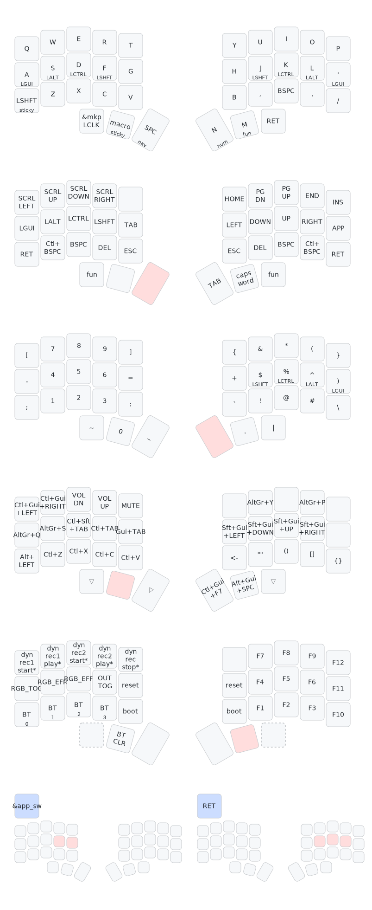

# Some ZMK config files

## Layout diagram for my Minidox keymap

- *April 2025*: I moved to Qwerty (with thumb alphas) after 2.5 years of using exclusively Colemak :confused: because maintaining two keyboard layouts in muscle memory is just too annoying.
- My QMK keymaps are available [here](https://github.com/agisga/qmk_userspace). In addition to what is shown below, in QMK I have:
    * RGB
    * [Dynamic macros](https://github.com/qmk/qmk_firmware/blob/master/docs/feature_dynamic_macros.md) on the `fun` layer. (very useful at times!)
- The visualization below was produced using <https://caksoylar.github.io/keymap-drawer>.

_*: Dynamic macros only in the QMK version of this keymap:_ <https://github.com/agisga/qmk_userspace>
